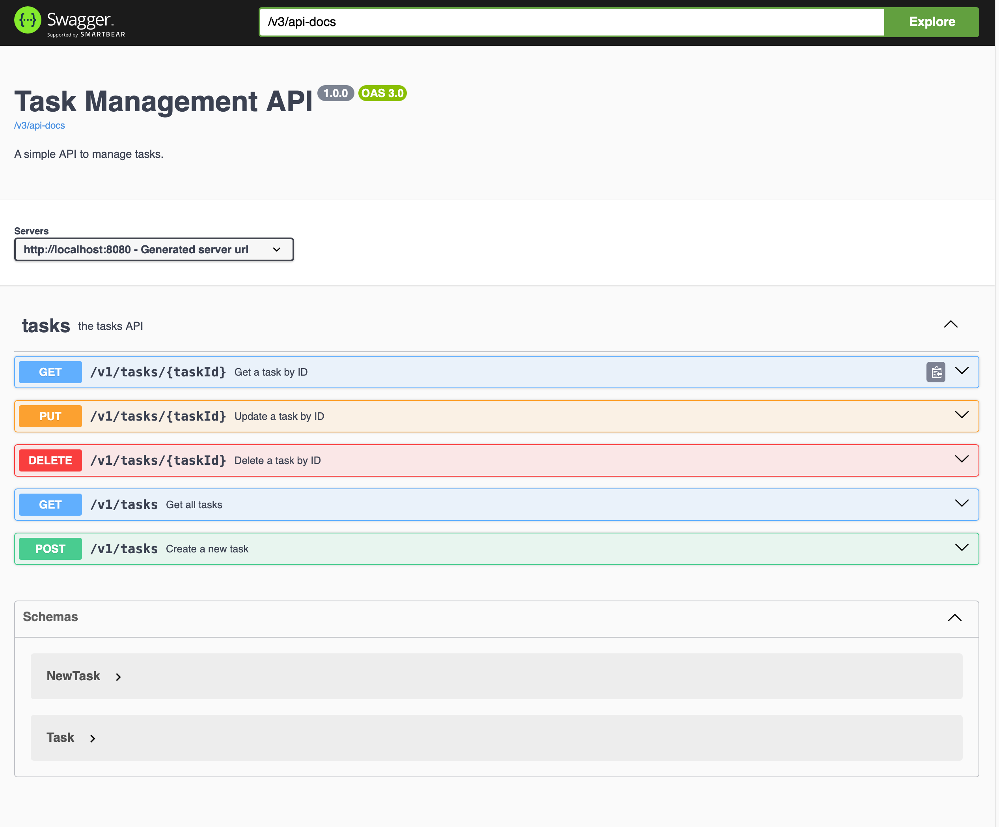
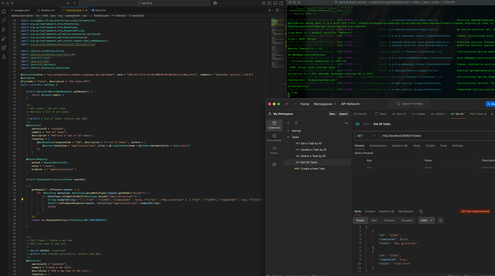
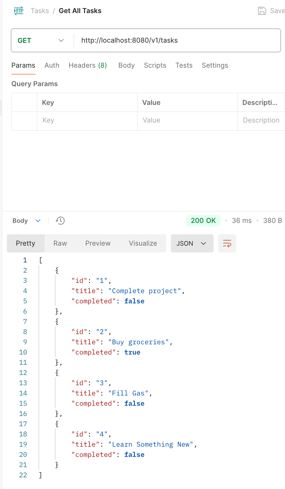

# API-First design

This approach utilizes creating the OpenAPI Spec 3.x compliant Swagger first and then utilizes [openapi generator](https://openapi-generator.tech/docs/generators/) to generate the scaffolding server code in multiple languages.

Install the OpenAPI Generator CLI using pip:
```
pip install openapi-generator-cli
```

Generate the Spring Boot server code:
```
openapi-generator-cli generate -i swagger.yaml -g spring -o spring-boot-server --additional-properties=library=spring-boot,useSpringBoot3=true,javaVersion=17
```

This command will generate a Spring Boot 3.x compatible project with Java 17 support56.

Navigate to the generated project directory:
```
cd spring-boot-server
```

Build and run the project using Maven:
```
mvn clean install
mvn spring-boot:run
```
The server will start on the default port 8080. You can now test your API endpoints using tools like Postman or cURL.






## Implement the Stubs
To implement the stubs generated by openapi-generator, navigate to the generated controller files, which will contain stub methods for each API endpoint.
Open /api/TaskApiController.java, add the following and restart the server. Voila the new tasks should show up in the Get All Tasks API call in Postman. 

```public class TasksApiController implements TasksApi {

   @Override
    public ResponseEntity<List<Task>> tasksGet() {
        // Create a sample list of tasks
        List<Task> tasks = new ArrayList<>();
        tasks.add(new Task().id("1").title("Complete project").completed(false));
        tasks.add(new Task().id("2").title("Buy groceries").completed(true));
        tasks.add(new Task().id("3").title("Fill Gas").completed(false));
        tasks.add(new Task().id("4").title("Learn Something New").completed(false));

        // Return the list of tasks
        return ResponseEntity.ok(tasks);
    }

    // Other methods...
}
```

Add necessary dependencies, configurations, and database connections as required by your implementation.
Test your implemented endpoints using tools like Postman or curl.
Iterate and refine the implementation as needed, ensuring it adheres to the API specification.
Remember to handle errors appropriately and implement proper data validation as defined in your OpenAPI specification



TODO:
- Implement one of the stubs with external API call, another with internal database with JPA etc. 
- Add exception handling and validations
- Add Test cases
- Utilize Very Good Security (VGS) for tokenizing sensitive data
- Add authentication to the APIs with Auth0
- CI/CD - Deploy the APIs to Kubernetes 